# Rock Paper Scissors Game

Rock, paper, scissors game is an easy and fun game to use in many different situations. For example; My collegues and I often use this game to dicide who's driving to the lunch restaurant, which often leads to a good laugh.
It is also a good gamebreaker to another game has ended in an equal result.

In this case we don't need a physical person to play the game, instead we are playing against a computer wich is coded to draw a random choise each time we play.

This site is targeted towards both adults and children.

_Note that the Mock up generator does not look exactly like the game actually does on the devices shown above._

---

## Features

### **1. Header**

The website has a header on top of the screen styled with a playful font.

### **2. Rules Area**

Although this game is commonly known, for thoose who are playing the game for the first time we want them to get familiar with the games rules before starting to play. In the rules-area that information is provided.

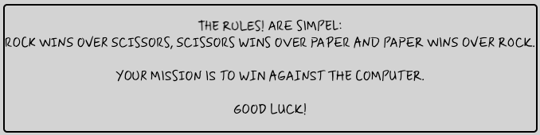

### **3. Game Area**

This is where the game is played. The player has 3 options: rock, paper and scissors. All of them are created as buttons with a havering effect that makes it visual to the player where the cursor on pointed. Buttons are styled with icons from Font Awesome added with description in text to make more sense.

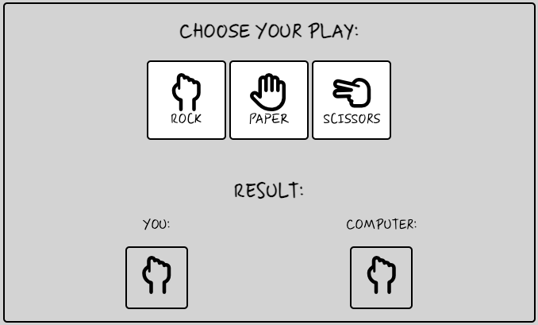

### **3.1 Player Choice**

When the player chooses it's play, they do so by clicking the button of the hand they think is going to win over the computer. The computer are coded to choose randomly between the same choices.

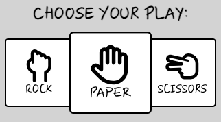

### **3.2 Result**

When the player clicks the button the result of that game is displayed in the results-area. To make the result more visual to the player we added background effect, like this:

If tie (yellow background):

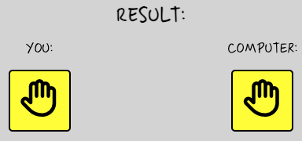

If player or computer win (red for loss, green for win):

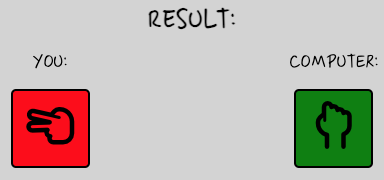

When the result is displayed, the background color goes back to it's default color (lightgray) after 1s. At first it was set to 2s but when I tested the game myself I found out that the game is probably played at a faster pace, and when the background color don't have the time to get it's default color the next play won't show it's result along with the win/loss/tie effect.

### **4. Score area**

After each round the score board is updated accordingly to the result:

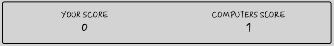

### **5. Footer**

In the footer I want to tell the player who's made the game.

### **6. Favicon**

Favicon added to the tab to add to the UX.

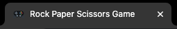

---

## **Features for the future**

Here are some of the features that I want to add in the future:
* Updated background with a more playful design.
* Updated player choice-buttons with a more playful design.
* Set a total game decider: first to 3 wins.
* Add color the score board to visualize who's ahead in the game (green for more wins then oppenent, red for less wins then opponent).
* Link more games to footer or menu bar for the player to choose from.

---

## Testing

There's been a lot of testing this game to be able to learn both the javascript code, and to learn how to delevop it to make it a good experience for the player.

The javascript was at frst hard to get right. I've used both CI's mini project Love Math's and two youtube videos and combined them to get sort of my own code (credits listed below under "Credits").

The front end testing was executed by both myself and friends who I let played the game for a couple of minutes and feedback me. Common for all players where that they at first clicked the wrong button to start the game. Instead of clicking the rock, paper, scissors button in the player choise area, they clikced on the button-alike symbols in the results area. That was fixed by changing background in the results area to the same as the rest of the game (lightgray). The player choice buttons are colored white to make it easier for the player to navigate.

Otherwise the players have been satisfied with the game.

### **Validator testing**

### **1. HTML**
The **HTML** code is tested in W3 Validator.

Result:

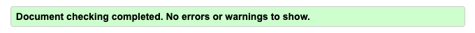

### **2. CSS**
The **CSS** code is tested in Jigsaw Validator with one warning for the import link from Google fonts.

Result:

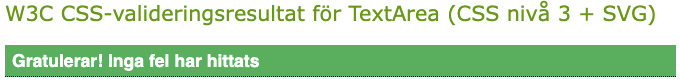
_Translated: W3C CSS validation results for TextArea (CSS level 3 + SVG). Congratulations! No errors have been found_

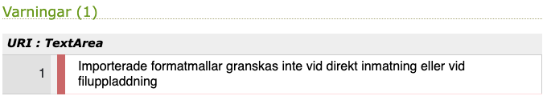
_Translated: Imported templates are not reviewed when entering directly or when uploading files_

### **3. Javascript**
The **Javascript** code is tested in JSHint.

Result:

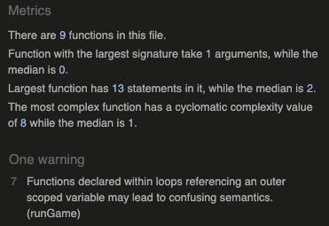

### **4. Lighthouse**
The **Lighthouse** testing went well and scored high numbers. At first I was a little bit unsure because it showed 79% performance when running the lighthouse in a browser window with 10-12 other tabs open. When I ran it incognito I got other numbers.

Result:

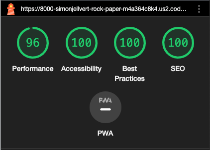

---

### **Bugs**

No bugs detected.

---

## **Deployment**

The site was deployed to GitHub in the following steps:
* In the GitHub repository I navigated to Seetings > Pages.
* From the source section drop-down menu i choosed Main Branch then clicked Save.
* After a few minutes the link to deployed site was provided.

The live link can be found here: Rock, Paper, Scissors Game(https://simonjellvert.github.io/rock-paper-scissors-game/).

---

## **Credits**

**Inspiration**
To code this game I had to get inspiration from other coders:
* A Greaves: [Love Maths](https://github.com/Code-Institute-Solutions/love-maths-2.0-sourcecode/tree/master).
* WebDevSimplified: [Rock Paper Scissors in JavaScript](https://github.com/WebDevSimplified/Rock-Paper-Scissors-In-JavaScript/tree/master).
* developedbyed: [Rock Paper Scissors](https://github.com/developedbyed/rock-paper-scissor/tree/master).

Thank you for your great tutorials and inspiration!

**Media**
* Fonts: [Google Font](https://fonts.google.com/).
* Icons: [Font Awesome](https://fontawesome.com/) and [Favicon](https://favicon.io/).
* Mock up to README: [Techsini](https://techsini.com/multi-mockup/).