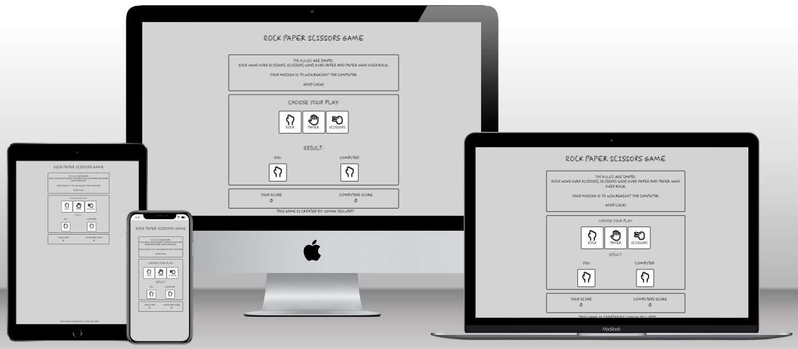

# Rock Paper Scissors Game

This website is a game for the user to try and beat the computer in rock, paper and scissors.

---

## Features

### **Header**

The website has a header that tells the

![Screenshot of ]

### **Rules Area**

### **Game Area**

Don't forget the 1 sek loading time for the colors to disapear before running a new game.

### **Footer**

### **Favicon**

Favicon added to the tab to add to the UX.

### **Features for the future**

Here are some of the features that will be added in the future:

---

## Testing

### **Validator testing**

The **HTML** code is tested in W3 Validator.

Result:

The **CSS** code is tested in Jigsaw Validator.

Result:

The **Javascript** code is tested in JSHint.

Result:

The **Lighthouse** testing went well and scored high numbers. At first I was a little bit unsure because it showed 79% performance when running the lighthouse in a browser window with 10-12 other tabs open. When I ran it incognito I got other numbers.

Result:

### **Unfixed bugs**

No bugs detected.

---

## **Deployment**

---

## **Credits**
